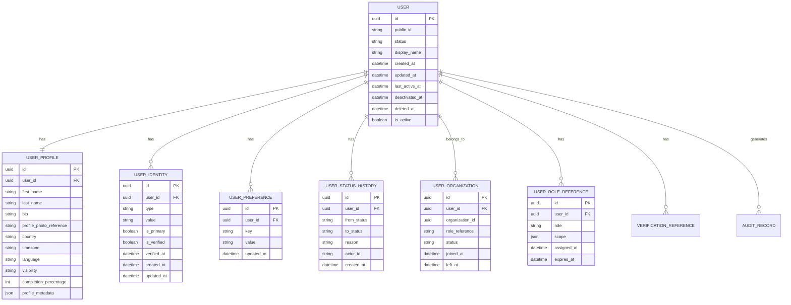
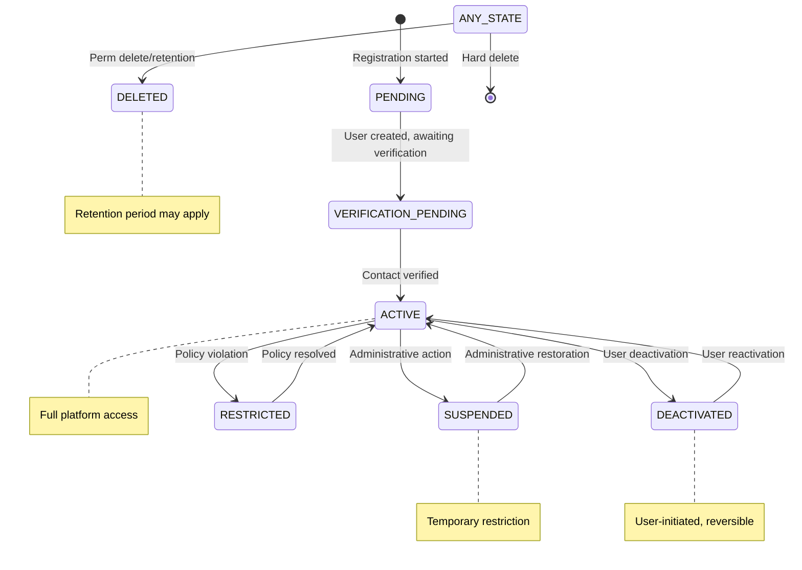

# BuildOS 019 User Service — Comprehensive Architecture Review & Implementation Blueprint

## Document Overview

**Review Date:** 2026-09-01  
**Service:** 019-buildos-user-service  
**Related Service:** 018-buildos-auth-service  
**Document Status:** Technical Architecture Review / Implementation Blueprint  
**Version:** 1.0

---

# 1. Executive Summary

The BuildOS 019 User Service is the foundational identity service responsible for managing **canonical user identity, account state, and core profile information**. It does **NOT** own authentication — that responsibility belongs exclusively to the 018 Auth Service.

## Key Findings

1. **Clear separation exists** in the documentation between authentication (018) and user profile (019). API-AUTH-001, API-USR-001, and API-PERM-001 establish clean boundaries.

2. **The registration flow** must be explicitly designed to ensure that 019 creates the canonical user before 018 creates authentication credentials. This avoids the problem of credentials existing without a user record.

3. **Identity resolution** is the critical integration point: 018 must be able to resolve an identifier (email/phone) to a canonical `user_id` before authenticating.

4. **Account lifecycle synchronization** between 018 and 019 is essential. When a user is disabled in 019, 018 must invalidate active tokens and reject future login attempts.

5. **The service boundary** is well-defined in the API specifications, with clear ownership of user profile, preferences, visibility, and status in 019, while authentication credentials, tokens, and password management remain in 018.

## Recommended Architecture

```
┌─────────────┐     ┌─────────────┐     ┌─────────────┐
│   Client    │────▶│  018 Auth   │────▶│  019 User   │
│  (Mobile/   │     │  Service    │     │  Service    │
│   Web)      │     │             │     │             │
└─────────────┘     └─────────────┘     └─────────────┘
                            │                    │
                            ▼                    ▼
                     ┌─────────────┐     ┌─────────────┐
                     │  Auth DB    │     │  User DB    │
                     │ (passwords, │     │ (profiles,  │
                     │  tokens)    │     │  state)     │
                     └─────────────┘     └─────────────┘
```

---

# 2. 019 Ownership Boundary

## 019 User Service Owns

| Responsibility | Documentation Source | Confidence |
|----------------|---------------------|------------|
| Canonical user identity (`user_id`) | API-USR-001 §9, DM-001 §5.1 | High |
| User account record | API-USR-001 §8 | High |
| User profile information | API-USR-001 §8, DM-001 §5.2 | High |
| Account lifecycle/state (`status`) | API-USR-001 §29-32 | High |
| User display name, first/last name | API-USR-001 §8 | High |
| Profile photo references | API-USR-001 §18-19 | High |
| Bio and public presentation | API-USR-001 §20 | High |
| User preferences (language, timezone) | API-USR-001 §25-26 | High |
| Profile visibility settings | API-USR-001 §27-28 | High |
| Profile completion metadata | API-USR-001 §34 | High |
| Account deactivation/reactivation | API-USR-001 §31-32 | High |
| Profile deletion request tracking | API-USR-001 §33 | High |
| User-organization memberships (if implemented) | API-USR-001 §36, DM-001 §6.2 | Medium |
| Verification status reference (not evidence) | API-USR-001 §11, 35 | High |
| Role summary references | API-USR-001 §36 | Medium |

## 018 Auth Service Owns

| Responsibility | Documentation Source | Confidence |
|----------------|---------------------|------------|
| Password hashes | API-AUTH-001 §27 | High |
| Password verification | API-AUTH-001 §14 | High |
| Login authentication | API-AUTH-001 §14 | High |
| Failed login tracking | API-AUTH-001 §15, §32 | High |
| Account lockout (auth failures) | API-AUTH-001 §32 | High |
| Access tokens | API-AUTH-001 §17 | High |
| Refresh tokens | API-AUTH-001 §18 | High |
| Token rotation | API-AUTH-001 §18 | High |
| Token revocation | API-AUTH-001 §20 | High |
| Logout | API-AUTH-001 §21 | High |
| Authentication events | API-AUTH-001 §48-49 | High |
| Password reset workflow | API-AUTH-001 §29-30 | High |
| Password change | API-AUTH-001 §28 | High |
| Contact verification (email/phone verification codes) | API-AUTH-001 §11-13 | High |
| Authentication sessions | API-AUTH-001 §23 | High |
| MFA (where implemented) | API-AUTH-001 §82 | Medium |

## Ambiguous Boundaries — Clarified

| Area | Documentation | Recommendation | Justification |
|------|--------------|----------------|---------------|
| Email/phone as identity | API-AUTH-001 §8, API-USR-001 §21 | 019 stores reference; 018 owns verification | 019 needs the identifier for user identity; 018 verifies it. The user record in 019 must contain email/phone for identity resolution, but 018 owns the verification process and credential linkage. |
| Account "status" sync | API-AUTH-001 §7, API-USR-001 §29 | 019 is source of truth; 018 enforces | When 019 changes status, 018 must invalidate sessions/tokens. 018 should check 019 user status during authentication. |
| User profile creation | API-USR-001 §10, API-AUTH-001 §8 | 019 creates profile; 018 creates credentials | Registration flow: 019 creates user → 018 creates credentials. Never vice versa. |
| Verification status exposure | API-USR-001 §11, 35 | 019 exposes summary; 018 doesn't need it | 018 doesn't need verification status for authentication. 019 exposes it for other services. |
| Organization membership | DM-001 §6.2, API-USR-001 §36 | 019 owns user-org relationships | 019 is the source for who a user is and what organizations they belong to. |

---

# 3. 018 ↔ 019 Responsibility Matrix

| Operation | 018 Auth Service | 019 User Service | Integration Pattern |
|-----------|------------------|------------------|---------------------|
| **Registration** | Creates credentials, verifies contact | Creates user record | 019 first, then 018 |
| **Login** | Validates credentials | Resolves identifier → user_id | 018 calls 019's identity resolution |
| **Account Status** | Enforces status (rejects auth if inactive) | Owns status updates | 019 publishes event; 018 consumes |
| **Profile Update** | N/A | Owns all profile mutations | Internal 019 API |
| **Password Change** | Owns password validation, hashing, update | N/A | Internal 018 API |
| **Password Reset** | Owns reset flow, token generation | N/A | Internal 018 API |
| **Logout** | Owns token/session invalidation | N/A | Internal 018 API |
| **Token Refresh** | Owns token refresh | N/A | Internal 018 API |
| **Account Deactivation** | Responds to status change | Owns status change, publishes event | Event-driven |
| **Identity Resolution** | N/A | Owns mapping identifier → user_id | 018 calls 019 API |
| **Profile Read** | N/A | Owns profile data | Internal 019 API or event-based caching |

---

# 4. Documentation Conflicts

## Conflict 1: Registration Ownership

| Document | Section | Requirement |
|----------|---------|-------------|
| API-AUTH-001 | §8 | POST `/api/v1/auth/register` creates account and returns `user_id` |
| API-USR-001 | §10 | POST `/api/v1/users` creates profile, "may occur during registration" |

**Issue:** Ambiguity about which service owns the registration transaction.

**Recommended Interpretation:** 019 owns the user record; 018 owns authentication credentials. **Registration flow** should be: 019 creates user → returns `user_id` → 018 creates credentials. This prevents credentials existing without a user record.

**Rationale:** This follows the architectural separation principle in API-CORE-001 §4.1 (Domain Ownership) and §4.5 (Data Ownership). A user must exist before authentication credentials can be associated with them.

**Impact:** 018's registration endpoint must call 019's user creation API first.

---

## Conflict 2: Email/Phone as Authentication vs Profile Data

| Document | Section | Requirement |
|----------|---------|-------------|
| API-AUTH-001 | §8 | Email and phone used for registration |
| API-USR-001 | §21 | Contact information owned by profile |
| API-USR-001 | §21 | "authentication service remains authoritative for authentication purposes" |

**Issue:** Email/phone used for both identity and authentication.

**Recommended Interpretation:** 019 stores email/phone as user identity references. 018 stores credential records that reference the same email/phone (as the `identifier` used for login). Email/phone are denormalized into both services but with different ownership semantics.

**Rationale:** 019 needs email/phone for identity resolution and profile display. 018 needs email/phone for authentication lookup. The canonical source of whether an email/phone is "verified" belongs to 018, but the fact that it's associated with a user belongs to 019.

**Impact:** Both services store email/phone, but for different purposes. 019 stores the identity reference; 018 stores the credential.

---

## Conflict 3: Verification Status Boundary

| Document | Section | Requirement |
|----------|---------|-------------|
| API-USR-001 | §11, 35 | 019 exposes verification status |
| API-IDV-001 | §2, §4 | Identity verification is separate |

**Issue:** Verification status overlaps with user profile.

**Recommended Interpretation:** 019 exposes a **summary** of verification status (e.g., `"verification": {"status": "verified", "level": "identity_verified"}`). The canonical verification record is owned by API-IDV-001. 019 does not store verification evidence.

**Rationale:** This follows API-USR-001 §11: "API-USR-001 may expose verification status as a controlled reference." The authoritative verification record remains in API-IDV-001.

**Impact:** 019 must expose verification status without owning the verification process.

---

## Conflict 4: Account Lifecycle States

| Document | Section | Requirement |
|----------|---------|-------------|
| API-USR-001 | §29 | Status: PENDING, ACTIVE, SUSPENDED, DEACTIVATED, RESTRICTED, DELETED |
| API-AUTH-001 | §7 | Account: Registered, Contact Verification Pending, Verified, Active, Suspended, Reactivated, Deactivated |
| BR-001 | §5 | Account: Active, Verification Pending, Restricted, Suspended, Deactivated |

**Issue:** Inconsistent account status terminology.

**Recommended Interpretation:** Use a unified status enumeration. 019 is the source of truth. 018 reads status from 019 and enforces authentication restrictions.

**Unified Status Enumeration:**

| Status | Description | Auth Service Behavior |
|--------|-------------|----------------------|
| `PENDING` | User created but not fully activated | Allow only limited operations |
| `VERIFICATION_PENDING` | Awaiting contact/identity verification | Allow only verification operations |
| `ACTIVE` | Full platform access | Allow all operations |
| `SUSPENDED` | Temporary restriction | Reject authentication (with explicit reason) |
| `DEACTIVATED` | User-initiated deactivation | Reject authentication |
| `RESTRICTED` | Limited access for policy violation | Allow only restricted operations |
| `DELETED` | Permanently removed | Reject all operations |

**Rationale:** The API-USR-001 statuses are more detailed and should be the source of truth. 018 maps these to authentication decisions.

---

## Conflict 5: User Preferences Ownership

| Document | Section | Requirement |
|----------|---------|-------------|
| API-USR-001 | §25-26 | `/api/v1/users/me/preferences` endpoints |
| API-NOTIF-001 | (Not in review) | Notification preferences |

**Issue:** Preferences might be split between user profile and notification service.

**Recommended Interpretation:** 019 owns **general user preferences** (language, timezone, profile visibility). Notification preferences are owned by API-NOTIF-001. 019 may store a reference to notification preferences but not duplicate notification-specific configuration.

**Rationale:** API-USR-001 §26 explicitly states: "Notification-specific configuration may be delegated to API-NOTIF-001." This follows the data minimisation principle.

**Impact:** 019 stores basic preferences; notification preferences are handled separately.

---

# 5. Canonical User Domain Model

## Entity Relationship Diagram



## Entity Descriptions

### USER

The core user account record. This is the foundational identity record for BuildOS.

**Purpose:** Represent the canonical user identity and account state.

**Key Relationships:**
- One-to-One with USER_PROFILE
- One-to-Many with USER_IDENTITY
- One-to-Many with USER_PREFERENCE
- One-to-Many with USER_STATUS_HISTORY

---

### USER_PROFILE

The user's profile information as defined in API-USR-001 §8.

**Purpose:** Store user-facing profile data.

**Key Relationships:**
- Owned by USER

---

### USER_IDENTITY

Email, phone, or other identifiers associated with a user.

**Purpose:** Provide identity resolution (email/phone → user_id) for authentication and other services.

**Key Relationships:**
- Owned by USER

**Identity Types:**
- `email`
- `phone`
- `username` (if implemented)
- `external_identity` (third-party ID)

---

### USER_PREFERENCE

Key-value storage for user preferences.

**Purpose:** Store user preferences as defined in API-USR-001 §25-26.

**Key Relationships:**
- Owned by USER

---

### USER_STATUS_HISTORY

Audit trail of user status changes.

**Purpose:** Provide auditability for account lifecycle changes as required by API-USR-001 §53-54.

**Key Relationships:**
- Owned by USER

---

### USER_ORGANIZATION

User-organization membership references.

**Purpose:** Track which organizations a user belongs to. Defined in DM-001 §6.2.

**Key Relationships:**
- Owned by USER
- References organization (owned by another service)

---

### USER_ROLE_REFERENCE

Controlled role summary references.

**Purpose:** Provide role information for authorization. Not an authoritative permission store (that's API-PERM-001).

**Key Relationships:**
- Owned by USER

---

# 6. Database Schema

## Migration 001: Create Users Table

```sql
CREATE TABLE users (
    id UUID PRIMARY KEY DEFAULT gen_random_uuid(),
    public_id TEXT NOT NULL UNIQUE,
    status TEXT NOT NULL DEFAULT 'pending',
    display_name TEXT,
    last_active_at TIMESTAMP WITH TIME ZONE,
    deactivated_at TIMESTAMP WITH TIME ZONE,
    deleted_at TIMESTAMP WITH TIME ZONE,
    created_at TIMESTAMP WITH TIME ZONE NOT NULL DEFAULT NOW(),
    updated_at TIMESTAMP WITH TIME ZONE NOT NULL DEFAULT NOW(),
    
    CONSTRAINT users_status_check CHECK (status IN (
        'pending',
        'verification_pending',
        'active',
        'suspended',
        'deactivated',
        'restricted',
        'deleted'
    )),
    CONSTRAINT users_public_id_check CHECK (public_id ~ '^usr_[A-Za-z0-9]{24}$')
);

CREATE INDEX idx_users_status ON users(status);
CREATE INDEX idx_users_public_id ON users(public_id);
CREATE INDEX idx_users_last_active ON users(last_active_at);
```

## Migration 002: Create User Profiles Table

```sql
CREATE TABLE user_profiles (
    id UUID PRIMARY KEY DEFAULT gen_random_uuid(),
    user_id UUID NOT NULL UNIQUE REFERENCES users(id) ON DELETE CASCADE,
    first_name TEXT,
    last_name TEXT,
    bio TEXT,
    profile_photo_reference TEXT,
    country TEXT,
    timezone TEXT NOT NULL DEFAULT 'Africa/Lagos',
    language TEXT NOT NULL DEFAULT 'en',
    visibility TEXT NOT NULL DEFAULT 'authenticated',
    completion_percentage INTEGER NOT NULL DEFAULT 0,
    profile_metadata JSONB DEFAULT '{}'::jsonb,
    created_at TIMESTAMP WITH TIME ZONE NOT NULL DEFAULT NOW(),
    updated_at TIMESTAMP WITH TIME ZONE NOT NULL DEFAULT NOW(),
    
    CONSTRAINT user_profiles_visibility_check CHECK (visibility IN (
        'public',
        'authenticated',
        'private'
    ))
);

CREATE INDEX idx_user_profiles_user_id ON user_profiles(user_id);
CREATE INDEX idx_user_profiles_country ON user_profiles(country);
```

## Migration 003: Create User Identities Table

```sql
CREATE TABLE user_identities (
    id UUID PRIMARY KEY DEFAULT gen_random_uuid(),
    user_id UUID NOT NULL REFERENCES users(id) ON DELETE CASCADE,
    type TEXT NOT NULL,
    value TEXT NOT NULL,
    is_primary BOOLEAN NOT NULL DEFAULT FALSE,
    is_verified BOOLEAN NOT NULL DEFAULT FALSE,
    verified_at TIMESTAMP WITH TIME ZONE,
    created_at TIMESTAMP WITH TIME ZONE NOT NULL DEFAULT NOW(),
    updated_at TIMESTAMP WITH TIME ZONE NOT NULL DEFAULT NOW(),
    
    CONSTRAINT user_identities_type_check CHECK (type IN (
        'email',
        'phone',
        'username',
        'external_identity'
    )),
    CONSTRAINT user_identities_value_normalized CHECK (length(value) >= 1),
    CONSTRAINT user_identities_unique_value UNIQUE (type, value)
);

CREATE INDEX idx_user_identities_user_id ON user_identities(user_id);
CREATE INDEX idx_user_identities_type_value ON user_identities(type, value);
CREATE INDEX idx_user_identities_value ON user_identities(value);
```

## Migration 004: Create User Preferences Table

```sql
CREATE TABLE user_preferences (
    id UUID PRIMARY KEY DEFAULT gen_random_uuid(),
    user_id UUID NOT NULL REFERENCES users(id) ON DELETE CASCADE,
    key TEXT NOT NULL,
    value TEXT NOT NULL,
    updated_at TIMESTAMP WITH TIME ZONE NOT NULL DEFAULT NOW(),
    
    CONSTRAINT user_preferences_unique_key UNIQUE (user_id, key)
);

CREATE INDEX idx_user_preferences_user_id ON user_preferences(user_id);
```

## Migration 005: Create User Status History Table

```sql
CREATE TABLE user_status_history (
    id UUID PRIMARY KEY DEFAULT gen_random_uuid(),
    user_id UUID NOT NULL REFERENCES users(id) ON DELETE CASCADE,
    from_status TEXT NOT NULL,
    to_status TEXT NOT NULL,
    reason TEXT,
    actor_id TEXT,
    created_at TIMESTAMP WITH TIME ZONE NOT NULL DEFAULT NOW()
);

CREATE INDEX idx_user_status_history_user_id ON user_status_history(user_id);
CREATE INDEX idx_user_status_history_created_at ON user_status_history(created_at);
```

## Migration 006: Create User Organization References Table

```sql
CREATE TABLE user_organizations (
    id UUID PRIMARY KEY DEFAULT gen_random_uuid(),
    user_id UUID NOT NULL REFERENCES users(id) ON DELETE CASCADE,
    organization_id TEXT NOT NULL,
    role_reference TEXT,
    status TEXT NOT NULL DEFAULT 'active',
    joined_at TIMESTAMP WITH TIME ZONE NOT NULL DEFAULT NOW(),
    left_at TIMESTAMP WITH TIME ZONE,
    created_at TIMESTAMP WITH TIME ZONE NOT NULL DEFAULT NOW(),
    updated_at TIMESTAMP WITH TIME ZONE NOT NULL DEFAULT NOW(),
    
    CONSTRAINT user_organizations_status_check CHECK (status IN (
        'active',
        'inactive'
    )),
    CONSTRAINT user_organizations_unique_membership UNIQUE (user_id, organization_id)
);

CREATE INDEX idx_user_organizations_user_id ON user_organizations(user_id);
CREATE INDEX idx_user_organizations_org_id ON user_organizations(organization_id);
```

## Migration 007: Create User Role References Table

```sql
CREATE TABLE user_role_references (
    id UUID PRIMARY KEY DEFAULT gen_random_uuid(),
    user_id UUID NOT NULL REFERENCES users(id) ON DELETE CASCADE,
    role TEXT NOT NULL,
    scope JSONB DEFAULT '{}'::jsonb,
    assigned_at TIMESTAMP WITH TIME ZONE NOT NULL DEFAULT NOW(),
    expires_at TIMESTAMP WITH TIME ZONE,
    created_at TIMESTAMP WITH TIME ZONE NOT NULL DEFAULT NOW(),
    updated_at TIMESTAMP WITH TIME ZONE NOT NULL DEFAULT NOW()
);

CREATE INDEX idx_user_role_references_user_id ON user_role_references(user_id);
CREATE INDEX idx_user_role_references_role ON user_role_references(role);
```

## Audit Triggers

```sql
-- User audit trigger
CREATE OR REPLACE FUNCTION audit_user_changes()
RETURNS TRIGGER AS $$
BEGIN
    INSERT INTO user_audit_events (
        user_id,
        action,
        changes,
        actor_id,
        ip_address,
        request_id
    ) VALUES (
        NEW.id,
        TG_OP,
        jsonb_build_object('old', OLD, 'new', NEW),
        current_setting('app.current_actor_id', TRUE),
        current_setting('app.current_ip', TRUE),
        current_setting('app.current_request_id', TRUE)
    );
    RETURN NEW;
END;
$$ LANGUAGE plpgsql;

CREATE TRIGGER audit_users
    AFTER INSERT OR UPDATE OR DELETE ON users
    FOR EACH ROW EXECUTE FUNCTION audit_user_changes();
```

---

# 7. User Lifecycle

## State Diagram



## Lifecycle Events

| State | Description | Auth Service Behavior | Event Published |
|-------|-------------|----------------------|-----------------|
| **PENDING** | User record created, not activated | Allow limited operations only | `USER_CREATED` |
| **VERIFICATION_PENDING** | Awaiting contact/identity verification | Allow verification operations only | `USER_VERIFICATION_PENDING` |
| **ACTIVE** | Full platform access | Allow all operations | `USER_ACTIVATED` |
| **SUSPENDED** | Temporary restriction | Reject authentication (explicit reason) | `USER_SUSPENDED` |
| **DEACTIVATED** | User-initiated deactivation | Reject authentication | `USER_DEACTIVATED` |
| **RESTRICTED** | Limited access (policy violation) | Reject non-restricted operations | `USER_RESTRICTED` |
| **DELETED** | Permanently removed | Reject all operations | `USER_DELETED` |

## State Transitions and Triggers

| From | To | Trigger | Requires Auth | Audited |
|------|----|---------|---------------|---------|
| [*] | PENDING | Registration start | No | Yes |
| PENDING | VERIFICATION_PENDING | Profile completion | User | Yes |
| VERIFICATION_PENDING | ACTIVE | Verification complete | System/API-IDV | Yes |
| ACTIVE | SUSPENDED | Admin action | Admin | Yes |
| SUSPENDED | ACTIVE | Admin restoration | Admin | Yes |
| ACTIVE | DEACTIVATED | User request | User | Yes |
| DEACTIVATED | ACTIVE | User reactivation | User | Yes |
| ACTIVE | RESTRICTED | Policy violation | Admin/System | Yes |
| RESTRICTED | ACTIVE | Policy resolved | Admin/System | Yes |
| ACTIVE | DELETED | Deletion request + retention | Admin/System | Yes |
| DEACTIVATED | DELETED | Deletion request + retention | Admin/System | Yes |

## Transition Validation Rules

1. **A user cannot transition from `SUSPENDED` to `DEACTIVATED`** — must go through `ACTIVE` first.
2. **A `DELETED` user cannot be reactivated** — deletion is terminal.
3. **A `PENDING` user cannot be `SUSPENDED`** — suspension only applies to active users.
4. **`DEACTIVATED` → `ACTIVE`** requires reauthentication via 018.
5. **Status changes require `reason` and `actor_id`** for audit purposes.

---

# 8. Registration Architecture

## Registration Flow

```
┌─────────┐      ┌─────────┐      ┌─────────┐      ┌─────────┐
│ Client  │      │  018    │      │  019    │      │  018    │
│         │      │ Auth    │      │ User    │      │ Cred    │
│         │      │ Service │      │ Service │      │ Create  │
└────┬────┘      └────┬────┘      └────┬────┘      └────┬────┘
     │                │                │                │
     │  POST /auth/register           │                │
     │───────────────▶│                │                │
     │                │                │                │
     │                │  POST /users/create             │
     │                │───────────────▶│                │
     │                │                │                │
     │                │                │   Validate     │
     │                │                │   Create user  │
     │                │                │   Generate ID  │
     │                │                │                │
     │                │   user_id + status             │
     │                │◀───────────────│                │
     │                │                │                │
     │                │  Create credentials            │
     │                │───────────────────────────────▶│
     │                │                │                │
     │                │                │                │
     │                │   credentials created          │
     │                │◀───────────────────────────────│
     │                │                │                │
     │  201 Created   │                │                │
     │◀───────────────│                │                │
     │                │                │                │
     │  Event: USER_CREATED           │                │
     │                │                │────────────────▶
```

## Registration Contract

### Endpoint: 018 Auth Service (Public)

```
POST /api/v1/auth/register
```

**Request:**
```json
{
    "email": "john@example.com",
    "phone": "+2348012345678",
    "first_name": "John",
    "last_name": "Doe",
    "password": "securepassword123"
}
```

**Processing:**
1. Validate email/phone format.
2. Check email/phone not already registered (call 019).
3. Call 019 to create user (with minimal profile).
4. 019 creates user record and returns `user_id`.
5. 018 creates authentication credential linked to `user_id`.
6. Return success with `user_id` and verification instructions.

**Response (201 Created):**
```json
{
    "user_id": "usr_01JXXXXXXXXXXXX",
    "status": "verification_pending",
    "verification": {
        "required": true,
        "channels": ["email", "phone"]
    }
}
```

---

## 019 User Creation API (Internal)

```
POST /internal/v1/users
```

**Request:**
```json
{
    "email": "john@example.com",
    "phone": "+2348012345678",
    "first_name": "John",
    "last_name": "Doe",
    "display_name": "John Doe",
    "country": "NG",
    "timezone": "Africa/Lagos",
    "language": "en"
}
```

**Validation:**
- Email format validation.
- Phone format validation (E.164).
- Email/phone uniqueness check.
- Name fields: min 1, max 100 characters.

**Response (201 Created):**
```json
{
    "user_id": "usr_01JXXXXXXXXXXXX",
    "status": "pending",
    "created_at": "2026-09-01T10:00:00Z"
}
```

### Error Responses

| HTTP Status | Error Code | Description |
|-------------|------------|-------------|
| 400 | `INVALID_EMAIL_FORMAT` | Email format invalid |
| 400 | `INVALID_PHONE_FORMAT` | Phone format invalid |
| 409 | `EMAIL_ALREADY_REGISTERED` | Email already in use |
| 409 | `PHONE_ALREADY_REGISTERED` | Phone already in use |
| 422 | `VALIDATION_FAILED` | Other validation failure |
| 500 | `INTERNAL_ERROR` | Unexpected failure |

### Duplicate Handling

1. **Email duplicates:** Return 409 with `EMAIL_ALREADY_REGISTERED`.
2. **Phone duplicates:** Return 409 with `PHONE_ALREADY_REGISTERED`.
3. **Idempotency:** Support `Idempotency-Key` header to prevent duplicate registration attempts.

---

# 9. Identity Resolution Architecture

## Purpose

018 Auth Service needs to resolve a user-provided identifier (email or phone) to a canonical `user_id` before authenticating.

## Endpoint: 019 User Service (Internal)

```
POST /internal/v1/users/resolve
```

### Request

```json
{
    "identifier": "john@example.com",
    "type": "email"
}
```

### Response (200 OK)

```json
{
    "user_id": "usr_01JXXXXXXXXXXXX",
    "status": "active",
    "identities": [
        {
            "type": "email",
            "value": "john@example.com",
            "is_verified": true
        },
        {
            "type": "phone",
            "value": "+2348012345678",
            "is_verified": false
        }
    ]
}
```

### Response (404 Not Found)

```json
{
    "error": {
        "code": "IDENTITY_NOT_FOUND",
        "message": "No user found with this identifier",
        "request_id": "req_123"
    }
}
```

### Response (410 Gone — Deleted User)

```json
{
    "error": {
        "code": "USER_DELETED",
        "message": "This user account has been deleted",
        "request_id": "req_123"
    }
}
```

## Resolution Rules

| Rule | Description |
|------|-------------|
| **Normalization** | Email: lowercase, trim whitespace. Phone: E.164 format normalization. |
| **Case Sensitivity** | Email: case-insensitive. Phone: case-insensitive. |
| **Username** (if implemented) | Case-insensitive, normalized. |
| **Deleted Users** | Return 410 (Gone) with `USER_DELETED`. |
| **Privacy** | Only return `user_id` and minimal status. Do not return full profile. |
| **Authorization** | Internal service only. Not exposed to clients. |

## Identifier Normalization

| Identifier Type | Normalization Rules | Example |
|-----------------|---------------------|---------|
| `email` | Lowercase, trim, remove comments | `John.Doe@Example.com` → `john.doe@example.com` |
| `phone` | E.164 format, remove spaces/special | `+234 801 234 5678` → `+2348012345678` |
| `username` | Lowercase, trim | `JohnDoe` → `johndoe` |

---

# 10. Complete 019 API Contract

## Public Endpoints (User Self-Service)

### GET /api/v1/users/me

Get current user's profile.

**Authentication:** Required (Bearer token)
**Authorization:** Self

**Response (200 OK):**
```json
{
    "user_id": "usr_01JXXXXXXXXXXXX",
    "first_name": "John",
    "last_name": "Doe",
    "display_name": "John Doe",
    "username": "johndoe",
    "status": "active",
    "profile_photo": {
        "url": "https://storage.buildos.com/...",
        "upload_id": "upl_123"
    },
    "bio": "Construction professional",
    "country": "NG",
    "timezone": "Africa/Lagos",
    "language": "en",
    "visibility": "authenticated",
    "verification": {
        "status": "verified",
        "level": "identity_verified"
    },
    "completion": 85,
    "created_at": "2026-09-01T10:00:00Z",
    "updated_at": "2026-09-01T10:30:00Z"
}
```

---

### PATCH /api/v1/users/me

Update current user's profile.

**Authentication:** Required (Bearer token)
**Authorization:** Self

**Request:**
```json
{
    "display_name": "John Doe",
    "bio": "Construction professional with 10 years experience",
    "language": "en",
    "timezone": "Africa/Lagos",
    "visibility": "authenticated"
}
```

**Response (200 OK):**
```json
{
    "user_id": "usr_01JXXXXXXXXXXXX",
    "updated": true,
    "updated_fields": ["display_name", "bio"]
}
```

**Error Response (403):**
```json
{
    "error": {
        "code": "FIELD_NOT_EDITABLE",
        "message": "The field 'verification_status' cannot be updated via self-service",
        "request_id": "req_123"
    }
}
```

---

### POST /api/v1/users/me/profile-photo/upload

Start profile photo upload.

**Authentication:** Required (Bearer token)
**Authorization:** Self

**Request:**
```json
{
    "content_type": "image/jpeg",
    "file_size": 1048576
}
```

**Response (201 Created):**
```json
{
    "upload_id": "upl_123",
    "upload_url": "https://storage.buildos.com/upload/...",
    "expires_in": 3600,
    "status": "pending"
}
```

---

### DELETE /api/v1/users/me/profile-photo

Remove current profile photo.

**Authentication:** Required (Bearer token)
**Authorization:** Self

**Response (200 OK):**
```json
{
    "deleted": true
}
```

---

### GET /api/v1/users/me/preferences

Get user preferences.

**Authentication:** Required (Bearer token)
**Authorization:** Self

**Response (200 OK):**
```json
{
    "language": "en",
    "timezone": "Africa/Lagos",
    "notification_preferences": {
        "email": true,
        "push": true
    }
}
```

---

### PATCH /api/v1/users/me/preferences

Update preferences.

**Authentication:** Required (Bearer token)
**Authorization:** Self

**Request:**
```json
{
    "language": "en",
    "timezone": "Africa/Lagos"
}
```

**Response (200 OK):**
```json
{
    "updated": true
}
```

---

### POST /api/v1/users/me/deactivate

Deactivate account.

**Authentication:** Required (Bearer token)
**Authorization:** Self

**Response (200 OK):**
```json
{
    "user_id": "usr_01JXXXXXXXXXXXX",
    "status": "deactivated",
    "deactivated_at": "2026-09-01T11:00:00Z"
}
```

---

### POST /api/v1/users/me/reactivate

Reactivate account.

**Authentication:** Required (Bearer token)
**Authorization:** Self

**Response (200 OK):**
```json
{
    "user_id": "usr_01JXXXXXXXXXXXX",
    "status": "active",
    "reactivated_at": "2026-09-01T11:30:00Z"
}
```

---

### POST /api/v1/users/me/deletion-request

Request account deletion.

**Authentication:** Required (Bearer token)
**Authorization:** Self

**Response (200 OK):**
```json
{
    "request_id": "del_123",
    "status": "requested",
    "estimated_completion": "2026-10-01T00:00:00Z"
}
```

---

## Internal Service-to-Service Endpoints

### POST /internal/v1/users/create

Create new user (called by 018 Auth Service).

**Authentication:** Service-to-service (API key or mTLS)
**Authorization:** Internal service

**Request:**
```json
{
    "email": "john@example.com",
    "phone": "+2348012345678",
    "first_name": "John",
    "last_name": "Doe",
    "display_name": "John Doe",
    "country": "NG",
    "timezone": "Africa/Lagos",
    "language": "en"
}
```

**Response (201 Created):**
```json
{
    "user_id": "usr_01JXXXXXXXXXXXX",
    "status": "pending",
    "created_at": "2026-09-01T10:00:00Z"
}
```

---

### POST /internal/v1/users/resolve

Resolve identifier to user.

**Authentication:** Service-to-service (API key or mTLS)
**Authorization:** Internal service

**Request:**
```json
{
    "identifier": "john@example.com",
    "type": "email"
}
```

**Response (200 OK):**
```json
{
    "user_id": "usr_01JXXXXXXXXXXXX",
    "status": "active",
    "identities": [
        {"type": "email", "value": "john@example.com", "is_verified": true}
    ]
}
```

**Response (410 Gone):**
```json
{
    "error": {
        "code": "USER_DELETED",
        "message": "This user account has been deleted",
        "request_id": "req_123"
    }
}
```

---

### GET /internal/v1/users/{user_id}/status

Get user status.

**Authentication:** Service-to-service (API key or mTLS)
**Authorization:** Internal service

**Response (200 OK):**
```json
{
    "user_id": "usr_01JXXXXXXXXXXXX",
    "status": "active",
    "is_active": true,
    "status_changed_at": "2026-09-01T10:00:00Z",
    "verification": {
        "status": "verified"
    }
}
```

---

### GET /internal/v1/users/{user_id}

Get user details (minimal).

**Authentication:** Service-to-service (API key or mTLS)
**Authorization:** Internal service

**Response (200 OK):**
```json
{
    "user_id": "usr_01JXXXXXXXXXXXX",
    "status": "active",
    "display_name": "John Doe",
    "first_name": "John",
    "last_name": "Doe",
    "email": "john@example.com",
    "phone": "+2348012345678",
    "created_at": "2026-09-01T10:00:00Z"
}
```

---

## Administrative Endpoints

### GET /api/v1/admin/users/{user_id}

Get user details (admin).

**Authentication:** Required (Admin token)
**Authorization:** Admin

**Response (200 OK):**
```json
{
    "user_id": "usr_01JXXXXXXXXXXXX",
    "first_name": "John",
    "last_name": "Doe",
    "display_name": "John Doe",
    "email": "john@example.com",
    "phone": "+2348012345678",
    "status": "active",
    "verification": {
        "status": "verified",
        "level": "identity_verified"
    },
    "created_at": "2026-09-01T10:00:00Z",
    "updated_at": "2026-09-01T10:30:00Z",
    "status_history": [
        {
            "from": "pending",
            "to": "active",
            "reason": "Contact verified",
            "created_at": "2026-09-01T10:05:00Z"
        }
    ]
}
```

**Authorization:** Admin only (not exposed to ordinary users).

---

### PATCH /api/v1/admin/users/{user_id}

Administrative user update.

**Authentication:** Required (Admin token)
**Authorization:** Admin

**Request:**
```json
{
    "status": "suspended",
    "reason": "Policy violation"
}
```

**Response (200 OK):**
```json
{
    "user_id": "usr_01JXXXXXXXXXXXX",
    "status": "suspended",
    "updated": true
}
```

---

### POST /api/v1/admin/users/{user_id}/suspend

Suspend user.

**Authentication:** Required (Admin token)
**Authorization:** Admin

**Request:**
```json
{
    "reason": "Policy violation",
    "duration": "30d"
}
```

**Response (200 OK):**
```json
{
    "user_id": "usr_01JXXXXXXXXXXXX",
    "status": "suspended",
    "suspended_at": "2026-09-01T12:00:00Z"
}
```

---

### POST /api/v1/admin/users/{user_id}/restore

Restore suspended user.

**Authentication:** Required (Admin token)
**Authorization:** Admin

**Request:**
```json
{
    "reason": "Appealed and resolved"
}
```

**Response (200 OK):**
```json
{
    "user_id": "usr_01JXXXXXXXXXXXX",
    "status": "active",
    "restored_at": "2026-09-01T12:30:00Z"
}
```

---

# 11. Service-to-Service Integration

## 018 ↔ 019 Integration Contract

### Authentication

**Mechanism:** Internal API key (Bearer token) with service identity.

**Request Headers:**
```
Authorization: Bearer {INTERNAL_API_KEY}
X-Service-ID: 018-auth-service
X-Request-ID: {request_id}
```

**API Key Management:**
- Separate keys per environment (dev, staging, prod).
- Keys stored in secret management (not in code).
- Keys support rotation without downtime.

### Timeouts and Retries

| Setting | Value | Rationale |
|---------|-------|-----------|
| Timeout | 5 seconds | User service should be fast; 018 cannot wait indefinitely |
| Retries | 3 attempts | Transient failures; exponential backoff |
| Circuit Breaker | 5 failures → open for 30s | Prevent cascading failures |

### Idempotency

**018 → 019 User Creation:**
```
Idempotency-Key: {registration_attempt_id}
```

019 should:
1. Check if user exists with this key → return existing user.
2. If not → create user and store idempotency record.

## Error Handling

### 019 Returns 500 (Service Unavailable)

**018 Behavior:**
1. Return 503 to client.
2. Log error.
3. Alert operations.

### 019 Returns 409 (Duplicate Email)

**018 Behavior:**
1. Return 409 to client with `EMAIL_ALREADY_REGISTERED`.
2. Do NOT create credentials.

---

# 12. Event Architecture

## Event Catalogue

| Event | Producer | Consumer | Schema Version |
|-------|----------|----------|----------------|
| `USER_CREATED` | 019 | 018 (optional), Notification, Audit | 1.0 |
| `USER_ACTIVATED` | 019 | 018 | 1.0 |
| `USER_SUSPENDED` | 019 | 018, Notification | 1.0 |
| `USER_DEACTIVATED` | 019 | 018, Notification | 1.0 |
| `USER_REACTIVATED` | 019 | 018, Notification | 1.0 |
| `USER_DELETED` | 019 | 018, Notification, Data Retention | 1.0 |
| `USER_RESTRICTED` | 019 | 018 | 1.0 |
| `USER_PROFILE_UPDATED` | 019 | Search, Analytics | 1.0 |
| `USER_PREFERENCES_UPDATED` | 019 | Notification | 1.0 |
| `USER_STATUS_CHANGED` | 019 | 018, Audit, Notification | 1.0 |

## Event Schema

### USER_CREATED

```json
{
    "event_id": "evt_01JXXXXXXXXXXXX",
    "event_type": "USER_CREATED",
    "event_version": "1.0",
    "occurred_at": "2026-09-01T10:00:00Z",
    "producer": "user-service",
    "correlation_id": "cor_01JXXXXXXXXXXXX",
    "causation_id": "req_01JXXXXXXXXXXXX",
    "subject": {
        "type": "user",
        "id": "usr_01JXXXXXXXXXXXX"
    },
    "data": {
        "user_id": "usr_01JXXXXXXXXXXXX",
        "status": "pending",
        "created_at": "2026-09-01T10:00:00Z"
    }
}
```

### USER_STATUS_CHANGED

```json
{
    "event_id": "evt_01JXXXXXXXXXXXX",
    "event_type": "USER_STATUS_CHANGED",
    "event_version": "1.0",
    "occurred_at": "2026-09-01T11:00:00Z",
    "producer": "user-service",
    "correlation_id": "cor_01JXXXXXXXXXXXX",
    "causation_id": "req_01JXXXXXXXXXXXX",
    "subject": {
        "type": "user",
        "id": "usr_01JXXXXXXXXXXXX"
    },
    "data": {
        "user_id": "usr_01JXXXXXXXXXXXX",
        "from_status": "active",
        "to_status": "deactivated",
        "reason": "User requested deactivation",
        "actor_id": "usr_01JXXXXXXXXXXXX",
        "changed_at": "2026-09-01T11:00:00Z"
    }
}
```

## 018 Consumer Behavior

| Event | 018 Action |
|-------|------------|
| `USER_SUSPENDED` | Invalidate all tokens; reject future login attempts |
| `USER_DEACTIVATED` | Invalidate all tokens; reject future login attempts |
| `USER_DELETED` | Delete credentials; invalidate all tokens |
| `USER_REACTIVATED` | Allow future login attempts (no automatic reinstate) |

---

# 13. Failure and Transaction Handling

## Case A: 019 Creates User → 018 Credential Creation Fails

**Scenario:** 019 creates user successfully, but 018 credential creation fails (database error, provider error, etc.).

**Handling:**
1. 018 should **not** delete the user from 019.
2. 018 should return 500 to client with appropriate error.
3. The user exists in 019 but has no credentials (cannot log in).
4. Allow retry with idempotency key.
5. If retry fails, manual reconciliation may be needed.

**Flow:**
```
1. 019 creates user → success (user exists)
2. 018 creates credential → fails
3. 018 returns 500 → "Registration incomplete"
4. User exists but cannot log in
5. Retry with same idempotency key → credential created
6. Or: Admin manually creates credential
```

---

## Case B: 018 Requests Registration Twice

**Scenario:** Client resends registration request (network retry, double-click, etc.).

**Handling:**
1. 018 sends `Idempotency-Key` with request.
2. 019 checks if user exists with this key → return existing user.
3. 018 sees existing user → does not create duplicate credentials.
4. Return success.

---

## Case C: 019 Temporarily Unavailable

**Scenario:** 019 service is down during registration.

**Handling:**
1. 018 should implement circuit breaker.
2. 018 returns 503 to client.
3. Client retries later.
4. No inconsistent state created (019 not modified).

---

## Case D: Timeout but 019 Actually Created User

**Scenario:** 018 times out waiting for 019 response, but 019 created the user.

**Handling:**
1. 018 should **not** assume failure.
2. 018 returns timeout error to client.
3. Client retries with idempotency key.
4. 019 returns existing user (idempotency record).
5. 018 creates credentials and returns success.

---

## Case E: User Disabled in 019 with Active Refresh Tokens in 018

**Scenario:** User is suspended/deactivated in 019, but 018 still has valid refresh tokens.

**Handling:**
1. 019 publishes `USER_SUSPENDED` or `USER_DEACTIVATED` event.
2. 018 consumes event.
3. 018 invalidates all tokens for that user.
4. 018 revokes all refresh tokens.
5. Subsequent authentication attempts fail with `ACCOUNT_RESTRICTED`.

**018 Behavior During Login:**
```
1. Client attempts login with credentials.
2. 018 resolves user_id via 019.
3. 018 checks user status from 019.
4. If status != ACTIVE → reject authentication.
5. If status == ACTIVE → proceed with credential check.
```

---

# 14. Security Review

## Security Findings

| # | Finding | Severity | Recommendation |
|---|---------|----------|----------------|
| 1 | Account enumeration possible via identity resolution | 🟡 Medium | Ensure 019 returns consistent errors for found/not found; no difference in response structure |
| 2 | Service-to-service auth without mTLS | 🟡 Medium | Use mTLS for production internal communications |
| 3 | Email enumeration in registration | 🟡 Medium | Return consistent error for duplicate email; no "email already exists" vs "user already exists" distinction |
| 4 | Insecure direct object references (IDOR) | 🔴 Critical | All endpoints must validate `user_id` against authenticated user's ID or admin role |
| 5 | Mass assignment vulnerability | 🟠 High | Use explicit PATCH fields; never bind all request fields directly to database |
| 6 | Sensitive data exposure in error messages | 🟢 Low | Ensure error messages don't reveal internal implementation details |
| 7 | Race conditions in status transitions | 🟠 High | Use optimistic locking with `updated_at` or version field |
| 8 | Privilege escalation via admin endpoints | 🔴 Critical | Admin endpoints must be protected by explicit admin authorization; never rely on UI hiding |
| 9 | Audit failure for critical operations | 🟠 High | Ensure all status changes, profile changes, and admin actions are audited |
| 10 | Unauthorized profile data access | 🟠 High | API must enforce visibility rules (public/authenticated/private) for profile retrieval |

## Mitigations

### Account Enumeration Prevention

**Registration:** Return generic error for duplicate email/phone:

```json
{
    "error": {
        "code": "REGISTRATION_FAILED",
        "message": "Unable to complete registration",
        "request_id": "req_123"
    }
}
```

**Identity Resolution:** Return consistent 404 for not found:

```json
{
    "error": {
        "code": "IDENTITY_NOT_FOUND",
        "message": "No user found with this identifier",
        "request_id": "req_123"
    }
}
```

### IDOR Prevention

**All endpoints must validate user_id:**

```python
def validate_user_access(user_id: str, current_user_id: str, is_admin: bool):
    if not is_admin and user_id != current_user_id:
        raise HTTPException(403, "ACCESS_DENIED")
```

### Mass Assignment Prevention

**Use Pydantic schemas with explicit fields:**

```python
class UserUpdateSchema(BaseModel):
    display_name: Optional[str] = None
    bio: Optional[str] = None
    language: Optional[str] = None
    timezone: Optional[str] = None
    visibility: Optional[str] = None
    # Do NOT include: user_id, status, created_at, etc.
```

### Privilege Escalation Prevention

**Admin endpoints require explicit admin check:**

```python
def require_admin(user_id: str):
    # Query user's role reference
    # Must have ADMIN role in 019 or via API-PERM-001
    if not is_admin(user_id):
        raise HTTPException(403, "ADMIN_REQUIRED")
```

---

# 15. Repository Architecture

## Directory Structure

```
019-buildos-user-service/
├── app/
│   ├── __init__.py
│   ├── main.py
│   ├── api/
│   │   ├── __init__.py
│   │   ├── dependencies.py
│   │   ├── v1/
│   │   │   ├── __init__.py
│   │   │   ├── router.py
│   │   │   ├── endpoints/
│   │   │   │   ├── __init__.py
│   │   │   │   ├── users.py
│   │   │   │   ├── profiles.py
│   │   │   │   ├── preferences.py
│   │   │   │   ├── status.py
│   │   │   │   └── admin.py
│   │   │   └── schemas/
│   │   │       ├── __init__.py
│   │   │       ├── user.py
│   │   │       ├── profile.py
│   │   │       ├── preferences.py
│   │   │       └── admin.py
│   │   └── internal/
│   │       ├── __init__.py
│   │       ├── router.py
│   │       ├── endpoints/
│   │       │   ├── __init__.py
│   │       │   ├── users.py
│   │       │   └── resolve.py
│   │       └── schemas/
│   │           ├── __init__.py
│   │           └── internal.py
│   ├── core/
│   │   ├── __init__.py
│   │   ├── config.py
│   │   ├── logging.py
│   │   ├── security.py
│   │   ├── exceptions.py
│   │   └── constants.py
│   ├── database/
│   │   ├── __init__.py
│   │   ├── connection.py
│   │   ├── models/
│   │   │   ├── __init__.py
│   │   │   ├── user.py
│   │   │   ├── profile.py
│   │   │   ├── identity.py
│   │   │   ├── preference.py
│   │   │   ├── status_history.py
│   │   │   ├── organization.py
│   │   │   └── role_reference.py
│   │   ├── repositories/
│   │   │   ├── __init__.py
│   │   │   ├── base.py
│   │   │   ├── user_repository.py
│   │   │   ├── profile_repository.py
│   │   │   ├── identity_repository.py
│   │   │   ├── preference_repository.py
│   │   │   └── status_history_repository.py
│   │   └── migrations/
│   │       └── versions/
│   │           ├── 001_create_users_table.py
│   │           ├── 002_create_user_profiles_table.py
│   │           ├── 003_create_user_identities_table.py
│   │           ├── 004_create_user_preferences_table.py
│   │           ├── 005_create_user_status_history_table.py
│   │           ├── 006_create_user_organizations_table.py
│   │           └── 007_create_user_role_references_table.py
│   ├── services/
│   │   ├── __init__.py
│   │   ├── user_service.py
│   │   ├── profile_service.py
│   │   ├── identity_service.py
│   │   ├── preference_service.py
│   │   ├── status_service.py
│   │   └── admin_service.py
│   ├── integrations/
│   │   ├── __init__.py
│   │   ├── auth/
│   │   │   ├── __init__.py
│   │   │   ├── client.py
│   │   │   └── schemas.py
│   │   └── events/
│   │       ├── __init__.py
│   │       ├── publisher.py
│   │       └── schemas.py
│   ├── events/
│   │   ├── __init__.py
│   │   ├── producers.py
│   │   ├── schemas.py
│   │   └── handlers.py
│   └── utils/
│       ├── __init__.py
│       ├── validators.py
│       ├── normalizers.py
│       └── id_generator.py
├── alembic.ini
├── pyproject.toml
├── Dockerfile
├── docker-compose.yml
├── .env.example
├── .gitignore
├── README.md
├── tests/
│   ├── __init__.py
│   ├── conftest.py
│   ├── unit/
│   │   ├── __init__.py
│   │   ├── test_services.py
│   │   └── test_models.py
│   ├── integration/
│   │   ├── __init__.py
│   │   ├── test_api.py
│   │   └── test_database.py
│   ├── contract/
│   │   ├── __init__.py
│   │   └── test_contracts.py
│   └── e2e/
│       ├── __init__.py
│       └── test_registration.py
└── scripts/
    ├── seed_data.py
    ├── run_tests.sh
    └── generate_public_id.py
```

---

# 16. Migration Plan

## Migration Order

| Migration | Name | Purpose | Dependencies |
|-----------|------|---------|--------------|
| 001 | `create_users_table` | Core user table | None |
| 002 | `create_user_profiles_table` | Profile data | `users` |
| 003 | `create_user_identities_table` | Identity references | `users` |
| 004 | `create_user_preferences_table` | User preferences | `users` |
| 005 | `create_user_status_history_table` | Audit trail | `users` |
| 006 | `create_user_organizations_table` | Organization membership | `users` |
| 007 | `create_user_role_references_table` | Role references | `users` |

## Migration File Structure

```python
# 001_create_users_table.py
from alembic import op
import sqlalchemy as sa
from sqlalchemy.dialects.postgresql import UUID
import uuid

def upgrade() -> None:
    op.create_table(
        'users',
        sa.Column('id', UUID(as_uuid=True), primary_key=True, server_default=sa.text('gen_random_uuid()')),
        sa.Column('public_id', sa.String(32), nullable=False, unique=True),
        sa.Column('status', sa.String(20), nullable=False, server_default='pending'),
        sa.Column('display_name', sa.String(100), nullable=True),
        sa.Column('last_active_at', sa.DateTime(timezone=True), nullable=True),
        sa.Column('deactivated_at', sa.DateTime(timezone=True), nullable=True),
        sa.Column('deleted_at', sa.DateTime(timezone=True), nullable=True),
        sa.Column('created_at', sa.DateTime(timezone=True), nullable=False, server_default=sa.func.now()),
        sa.Column('updated_at', sa.DateTime(timezone=True), nullable=False, server_default=sa.func.now()),
        sa.CheckConstraint("status IN ('pending', 'verification_pending', 'active', 'suspended', 'deactivated', 'restricted', 'deleted')", name='users_status_check'),
        sa.CheckConstraint("public_id ~ '^usr_[A-Za-z0-9]{24}$'", name='users_public_id_check')
    )
    op.create_index('idx_users_status', 'users', ['status'])
    op.create_index('idx_users_public_id', 'users', ['public_id'])
    op.create_index('idx_users_last_active', 'users', ['last_active_at'])

def downgrade() -> None:
    op.drop_index('idx_users_last_active')
    op.drop_index('idx_users_public_id')
    op.drop_index('idx_users_status')
    op.drop_table('users')
```

---

# 17. Testing Strategy

## Test Categories

### 1. Unit Tests

| Test | Description | Files |
|------|-------------|-------|
| User creation | Validate user creation logic | `test_user_service.py` |
| Status transitions | Validate state machine rules | `test_status_service.py` |
| Identity resolution | Validate email/phone lookup | `test_identity_service.py` |
| Normalization | Validate email/phone normalization | `test_validators.py` |
| ID generation | Validate `public_id` generation | `test_id_generator.py` |

### 2. Repository Tests

| Test | Description |
|------|-------------|
| User CRUD | Create, read, update, soft delete |
| Identity lookup | Find user by email/phone |
| Status history | Record and retrieve status changes |
| Preference CRUD | Create, read, update preferences |

### 3. API Tests

| Test | Description |
|------|-------------|
| GET `/users/me` | Authenticated user retrieval |
| PATCH `/users/me` | Profile update with validation |
| POST `/internal/users/create` | Internal user creation |
| POST `/internal/users/resolve` | Identity resolution |
| Admin endpoints | Privileged access control |

### 4. Integration Tests

| Test | Description |
|------|-------------|
| Database | Ensure schema matches models |
| Event publishing | Ensure events are published on state change |
| Auth integration | Full registration flow with 018 |

### 5. Contract Tests

| Test | Description |
|------|-------------|
| 018 ↔ 019 | Verify request/response contracts |
| Event contracts | Verify event schemas |

### 6. Security Tests

| Test | Description |
|------|-------------|
| IDOR | Attempt unauthorized access |
| Account enumeration | Attempt to enumerate emails |
| Privilege escalation | Attempt admin without authorization |
| Mass assignment | Attempt to update restricted fields |
| Rate limiting | Verify rate limits enforced |

### 7. End-to-End Tests

**Registration Flow:**
```
1. Client requests registration
2. 018 validates input → calls 019
3. 019 creates user → returns user_id
4. 018 creates credentials → returns success
5. Client logs in with credentials
6. 018 resolves user_id via 019 → validates credentials
7. User successfully authenticated
```

**Account Lifecycle:**
```
1. Create user
2. User status = PENDING
3. Verify contact (018 handles verification)
4. User status = ACTIVE (019 event)
5. User deactivates → status = DEACTIVATED (event)
6. 018 invalidates tokens
7. User reactivates → status = ACTIVE (event)
8. User can log in again
```

---

# 18. 018 Compatibility Findings

## 018 Current State

Based on the provided documentation, 018 expects:

| Field | 018 Usage |
|-------|-----------|
| `user_id` | Canonical user identity stored in `AuthCredential` |
| `email` | Used as identifier in `AuthCredential` |
| `phone` | Used as identifier in `AuthCredential` |
| `organization_id` | Present in `AuthCredential` for company/org context |
| `membership_id` | Present in `AuthContext` |

## What 019 Must Provide

| Required | API | 018 Expectation |
|----------|-----|-----------------|
| `user_id` | POST `/internal/users/create` | Returned on user creation |
| Email/phone resolution | POST `/internal/users/resolve` | Map identifier → user_id |
| User status | GET `/internal/users/{user_id}/status` | `ACTIVE` check for authentication |

## 018 Assumptions That Need Verification

| Assumption | Verified? | Impact |
|------------|-----------|--------|
| `user_id` is generated by 019 and returned | ✅ Yes | 018 stores this |
| 019 owns the user record | ✅ Yes | 018 doesn't duplicate user data |
| 019 exposes status | ✅ Yes | 018 checks status during auth |
| Email/phone are unique identifiers | ✅ Yes | 019 enforces uniqueness |
| Account deactivation is handled by 019 | ✅ Yes | 018 consumes events |

---

# 19. Required Changes to 018

## 1. Registration Endpoint Update

**Current:** 018 creates user and credentials in one transaction.

**Required:** 018 calls 019 to create user first, then creates credentials.

**Implementation:**
```python
# 018 POST /api/v1/auth/register

async def register(request: RegistrationRequest):
    # 1. Validate request
    # 2. Call 019 to create user
    user = await user_client.create_user(
        email=request.email,
        phone=request.phone,
        first_name=request.first_name,
        last_name=request.last_name
    )
    # 3. Create authentication credential
    credential = await create_credential(
        user_id=user.user_id,
        identifier=request.email,
        hashed_password=hash_password(request.password)
    )
    # 4. Return success
    return {
        "user_id": user.user_id,
        "status": user.status,
        "verification": {"required": True}
    }
```

## 2. Identity Resolution Integration

**Current:** 018 uses email directly from credential record.

**Required:** 018 calls 019 to resolve identifier → user_id.

**Implementation:**
```python
# 018 Login flow

async def login(request: LoginRequest):
    # 1. Resolve identifier to user_id via 019
    user = await user_client.resolve_identity(
        identifier=request.identifier,
        type="email"  # or "phone"
    )
    if user.status != "active":
        raise AccountRestrictedError(user.status)
    
    # 2. Look up credential by user_id
    credential = await get_credential_by_user_id(user.user_id)
    # 3. Verify password
    if not verify_password(request.password, credential.hashed_password):
        increment_failed_attempts(user.user_id)
        raise InvalidCredentials()
    # 4. Generate tokens
    tokens = generate_tokens(user.user_id)
    return tokens
```

## 3. Account Status Awareness

**Current:** 018 may not check user status from 019.

**Required:** 018 always checks 019 status during authentication.

**Implementation:**
```python
# 018 Middleware or authentication flow

async def authenticate_user(identifier: str, password: str):
    # 1. Resolve user via 019
    user = await user_client.resolve_identity(identifier)
    
    # 2. Check status
    if user.status != "active":
        raise AccountRestrictedError(
            code=f"ACCOUNT_{user.status.upper()}",
            message=f"Account is {user.status}"
        )
    
    # 3. Continue with credential verification
    # ...
```

## 4. Event Consumer

**Required:** 018 subscribes to 019 status change events.

**Implementation:**
```python
# 018 Event handler

async def handle_user_status_changed(event: UserStatusChangedEvent):
    if event.to_status in ["suspended", "deactivated", "deleted"]:
        await invalidate_all_tokens(event.user_id)
        await revoke_all_refresh_tokens(event.user_id)
    
    if event.to_status == "reactivated":
        # Don't automatically reinstate tokens
        # User must log in again
        pass
```

---

# 20. 019 Implementation Phases

## Phase 1: Foundation (Week 1)

**Goal:** Basic repository setup and database schema.

**Deliverables:**
- ✅ Repository structure
- ✅ Dockerfile
- ✅ docker-compose.yml
- ✅ Alembic setup
- ✅ Core configuration
- ✅ Database connection
- ✅ ORM models
- ✅ Migrations 001-007

**Acceptance:**
- Service starts
- Database creates all tables
- Tests pass

---

## Phase 2: User Domain (Week 1-2)

**Goal:** Core user CRUD and identity management.

**Deliverables:**
- ✅ UserRepository
- ✅ UserService
- ✅ IdentityRepository
- ✅ IdentityService
- ✅ User creation logic
- ✅ Identity resolution logic
- ✅ Unit tests

**Acceptance:**
- Create user with email/phone
- Resolve email → user_id
- Resolve phone → user_id
- Duplicate email/phone rejected
- Public ID generation works

---

## Phase 3: Profile & Preferences (Week 2)

**Goal:** Profile and preference management.

**Deliverables:**
- ✅ ProfileRepository
- ✅ ProfileService
- ✅ PreferenceRepository
- ✅ PreferenceService
- ✅ Profile update logic
- ✅ Preference update logic

**Acceptance:**
- Update profile fields
- Update preferences
- Profile photo upload reference
- Completion percentage calculation

---

## Phase 4: Status Lifecycle (Week 2-3)

**Goal:** Account state management and events.

**Deliverables:**
- ✅ StatusService
- ✅ StatusHistoryRepository
- ✅ Status transitions
- ✅ Event publishing
- ✅ Account deactivation
- ✅ Account reactivation

**Acceptance:**
- Status transitions validated
- History recorded
- Events published on status change
- Deactivation/reactivation works

---

## Phase 5: API Layer (Week 3)

**Goal:** Complete API implementation.

**Deliverables:**
- ✅ Public endpoints (v1)
- ✅ Internal endpoints
- ✅ Admin endpoints
- ✅ Schema validation
- ✅ Error handling
- ✅ Authentication/authorization

**Acceptance:**
- All endpoints functional
- Correct HTTP status codes
- Validation rules enforced
- Authorization enforced

---

## Phase 6: Service-to-Service Integration (Week 3-4)

**Goal:** 018 integration readiness.

**Deliverables:**
- ✅ Internal API contract
- ✅ Identity resolution endpoint
- ✅ User status endpoint
- ✅ Idempotency support
- ✅ Timeout and retry handling
- ✅ Circuit breaker

**Acceptance:**
- 018 can call all internal endpoints
- Idempotency works
- Error handling works
- Timeouts handled gracefully

---

## Phase 7: Event Architecture (Week 4)

**Goal:** Event publishing and consumption.

**Deliverables:**
- ✅ Event producer
- ✅ Event schemas
- ✅ Event publishing on state changes
- ✅ 018 event consumer (in 018)

**Acceptance:**
- Events published on status changes
- 018 consumes events
- Token invalidation on status change

---

## Phase 8: Testing (Week 4-5)

**Goal:** Complete test suite.

**Deliverables:**
- ✅ Unit tests
- ✅ Integration tests
- ✅ Contract tests
- ✅ End-to-end tests
- ✅ Security tests

**Acceptance:**
- All tests pass
- Registration flow works end-to-end
- Login flow works end-to-end
- Status sync works

---

## Phase 9: Production Readiness (Week 5)

**Goal:** Production deployment readiness.

**Deliverables:**
- ✅ Documentation
- ✅ Monitoring
- ✅ Logging
- ✅ Metrics
- ✅ Health checks
- ✅ Deployment pipeline
- ✅ Rollback strategy

**Acceptance:**
- Service is production-ready
- All dependencies documented
- Runbooks available

---

# 21. Definition of Done

## 019 User Service is complete when:

| # | Criteria | Status |
|---|----------|--------|
| 1 | Repository structure established | ⬜ |
| 2 | Database migrations applied | ⬜ |
| 3 | Core user CRUD operations work | ⬜ |
| 4 | Identity resolution works (email/phone → user_id) | ⬜ |
| 5 | Profile and preferences APIs work | ⬜ |
| 6 | Account status lifecycle works | ⬜ |
| 7 | Status history is recorded | ⬜ |
| 8 | All public APIs documented and implemented | ⬜ |
| 9 | All internal APIs documented and implemented | ⬜ |
| 10 | Service-to-service authentication works | ⬜ |
| 11 | Idempotency works for user creation | ⬜ |
| 12 | Events published on status changes | ⬜ |
| 13 | 018 consumes status events | ⬜ |
| 14 | End-to-end registration works | ⬜ |
| 15 | End-to-end login works | ⬜ |
| 16 | Account deactivation syncs to 018 | ⬜ |
| 17 | Security tests pass | ⬜ |
| 18 | Integration tests pass | ⬜ |
| 19 | Production deployment works | ⬜ |
| 20 | Documentation complete | ⬜ |

## Success Criteria

**Real user → 019 → 018 → authentication works without mocks.**

When a real user can:
1. Register via 018
2. Have their user record created in 019
3. Have credentials created in 018
4. Log in using their credentials
5. Have 018 resolve their identity via 019
6. Receive an access token
7. Refresh their token
8. Deactivate their account (syncs to 018)
9. Reactivate their account
10. Delete their account (with proper retention)

---

# 22. Blocking Decisions / Questions

## 1. Service-to-Service Authentication

**Question:** What mechanism should 018 and 019 use to authenticate internal requests?

**Options:**
- A) Internal API key (Bearer token)
- B) mTLS
- C) JWT with service identity
- D) OAuth2 client credentials

**Recommendation:** A) Internal API key (Bearer token) + service identity header. Simple, secure enough for internal traffic. mTLS can be added later.

**Blocks:** Internal endpoint security.

---

## 2. Email/Phone Uniqueness Across Users

**Question:** Can the same email/phone be associated with multiple users?

**Recommendation:** No. Email and phone must be globally unique across all users (for primary identifiers). This aligns with API-AUTH-001 §10.

**Blocks:** User creation logic.

---

## 3. Email/Phone Verification Status Source

**Question:** Who marks email/phone as verified — 018 or 019?

**Recommendation:** 018 marks email/phone as verified after the verification flow. 019 stores the `is_verified` flag (as a denormalized reference). 018 is the source of truth for "verified" status.

**Blocks:** Identity model design.

---

## 4. Organization and Membership Handling

**Question:** Does 019 own organization relationships, or is that a separate service?

**Recommendation:** 019 owns user-organization membership as a reference. API-PERM-001 owns authorization within organization. 019 stores the membership but does not evaluate permissions.

**Blocks:** Organization tables design.

---

## 5. Event Broker Technology

**Question:** What event broker will be used for publishing events?

**Options:**
- A) RabbitMQ
- B) Apache Kafka
- C) Redis Pub/Sub
- D) Cloud-native (SQS, etc.)

**Recommendation:** A) RabbitMQ for simplicity. Can be upgraded to Kafka later if volume requires.

**Blocks:** Event publishing implementation.

---

## 6. Profile Photo Storage

**Question:** Where are profile photos stored? Who owns the storage service?

**Recommendation:** 019 stores only the **reference** to the photo (storage URL, upload ID, etc.). A separate media/storage service owns the actual file storage. 019 delegates upload generation to that service.

**Blocks:** Profile photo API implementation.

---

## 7. Username Support

**Question:** Will BuildOS support usernames (unique, user-friendly identifiers)?

**Recommendation:** Yes, per API-USR-001 §17. Usernames should be unique, normalized, and validated.

**Blocks:** Identity table design (adding username type).

---

## 8. Multi-Region / Data Residency

**Question:** Does 019 need to support data residency requirements?

**Recommendation:** For now, no. Data residency requirements will be addressed later when international expansion is planned.

**Blocks:** None currently.

---

## 9. Verification Level Granularity

**Question:** How granular should verification status be?

**Recommendation:** Start with: `status` (pending/verified/failed) and `level` (contact/identity/business/professional). Extend later as needed.

**Blocks:** Verification reference in profile API.

---

## 10. Hard Delete vs Soft Delete

**Question:** Should users be hard-deleted from the database?

**Recommendation:** No. Always soft-delete (`deleted_at`). Hard deletion only after retention period, and only via automated process, never via API. This aligns with DR-001 §7.1.

**Blocks:** Delete flow design.

---

**End of BuildOS 019 User Service — Comprehensive Architecture Review & Implementation Blueprint**